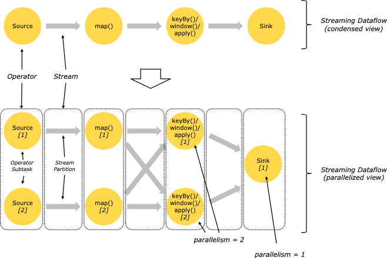
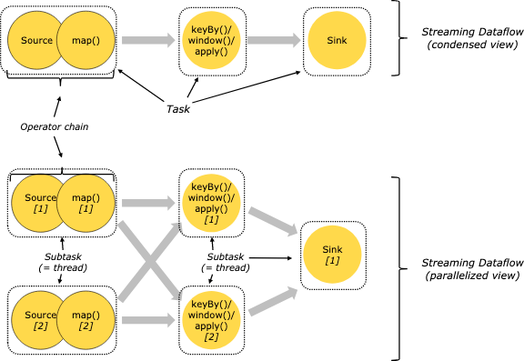

1. Client vs Cluster
    1. 上图可以分成两块 左侧的 Client 和 右侧的 Cluster 两个部分
    2. Client 负责提交 作业 Job （一个 Flink Program）
    3. 代码翻译成 Dataflow Graph 是在 Client 端完成的（代码编译在 Client）
    4. Dataflow Graph 的优化也是在 Client 端完成的
2. JobManager 与 TaskManager
    1. 都是组成 Flink Cluster 的基本节点
    2. JobManager 是集群的"Master"，负责
        * 接收 Client 提交 的 Job
        * 与 Client 交互 统计信息和结果
        * 接收 对 Job 的操作，例如 Cancel 、 Resume 和 Stop
    2. 可以通过不断向 JobManager 注册 TaskManager 来对集群进行横向扩展
    3. JobManager 其实也可以多实例，用于保障高可用性
    4. JobManager 负责 Job 的调度、Checkpoint 机制的维护等
    5. TaskManager 是集群的"Worker"，实际上是为集群提供 Operator 执行的容器 Task Slot
    6. Stream 的数据交换是 TaskManager 之间的直接通讯
3. JobManager 承担的角色
    1. ResourceManager
        * 承担计算资源的分配和回收，以slot 为单位和操作对象
        * flink 为了适应多种底层资源平台，实现了多种resource manager，例如: YARN, Mesos, Kubernetes and 单机
        * 单机模式下，无法自主创建新的 TaskManager
    2. Dispatcher
        * 提供 REST 接口: 提交Job，启动新的 JobMaster 等
        * flink web ui
    3. JobMaster
        * 一个 JobMaster 管理单个 JobGraph 的执行
4. 不同的角度看 Dataflow Graph
    * Parallel Dataflow

        
        1. Streaming Dataflow(condensed view) 是数据处理流程的逻辑视图
        2. Streaming Dataflow(condensed view) 会在 Job Master 上根据并发展开成 Streaming Dataflow(parallelized view)
        3. 根据并发度一一对应展开
        4. 可能会出现 shuffle 过程
    * Parallel Dataflow with Operator Chains
      
        
        1. 在"Parallel Dataflow"中只讲了一一对应展开
        2. 实际上，许多 operator 可以串在一起
        3. 串在一起之后的 operator chain 占据一个 slot（这里还是不太准确，后文还会加条件）

    * Operator Chains running in Slots
      
        
        1. 这里将 operator 的分配机制
        2. 原则上，已经可以为一个 Operator Chain 分配一个 Slot
            + 一个 TaskManager 是一个jvm 进程
            + 一个 Operator Chain 就是一个 thread

    * Operator Chains share Slots with Threads
      
        
        1. 但 flink TaskManager 上的 Slot 并不是对应一个 thread
        2. 一个 Slot 包含多个 thread，这样一个Slot 内就可以包含多个 operator: slot sharing
        3. 当然，这种特殊的划分是带有目的性的，所以，有分配规则
            + 同一个 Slot 内包含的是同一个 job 的不同 operator 的实例
            + 与operator chain 一样，这样也有利于提高资源的利用率（组合与衔接）
            + 同时也没有抛弃"同一个 operator 的不同实例在集群上充分铺开"的优点

5. flink 的执行模式
    * 提一个可能被忽略的点: 一个 jar 内的 main 方法，可以提交多个 flink job
    * Session Cluster
        + 长期存在
        + 预先分配
        + 多个 job 可能共享一个 TaskManager，具有竞争关系
        + 如果某个 job 导致 TaskManager 整个失败（jvm 失败），就会影响在这个 TaskManager 上分配的所有 job
        + 隔离性看起来没有那么好，但实际上在绝大多数场景已经够用了
        + 这种预先分配的机制，当然带来了快速启动的优势: 多平快的数据处理，一般都使用这种方式
    * Job Cluster
        + Job Cluster 是在 job 提交以后动态启动的
        + 一个 job 占用 一个 Job Cluster
        + 以搭建在 yarn 上的 Job Cluster 为例
            1. 启动一个 JobManager: ./bin/flink run-application -t yarn-application ./examples/batch/WordCount.jar
            2. 相应的 TaskManager 会随后启动
            3. ./bin/flink run -m yarn-cluster ./examples/batch/WordCount.jar
       + yarn 上一样可以起 flink session cluster
            1. ./bin/yarn-session.sh
    * Application Cluster
        1. ./bin/flink run-application -t yarn-application ./examples/batch/WordCount.jar
        2. 在某种程度上不是 Cluster 模式